<div align="center">

# 🌐 AI Educademy

### Learn AI from Zero to Hero — Free & Open Source

<br />


<br />

An **open-source AI education platform** with 15 structured programs across 3 learning tracks, available in 11 languages. From absolute beginners to advanced practitioners — learn AI interactively with MDX lessons, an interactive lab, AI chatbot, mock interviews, progress tracking, and Pro subscriptions for premium content.

<br />

[**🚀 Start Learning**](https://aieducademy.org) &nbsp;·&nbsp; [**📝 Blog**](https://aieducademy.org/en/blog) &nbsp;·&nbsp; [**🎨 Storybook**](https://aieducademy.github.io/ai-ui-library/) &nbsp;·&nbsp; [**📦 UI Library**](https://www.npmjs.com/package/@aieducademy/ai-ui-library) &nbsp;·&nbsp; [**🤝 Contributing**](CONTRIBUTING.md)

<br />

</div>

---

## 📸 Screenshot

> [Screenshot coming soon]

---

## ✨ Features

| | Feature | Description |
|---|---------|-------------|
| 🌍 | **11 Languages** | EN, FR, NL, HI, TE, ES, PT, DE, ZH, JA, AR — [add yours!](CONTRIBUTING.md) |
| 📚 | **15 Programs, 3 Tracks** | AI Foundations + AI Mastery + Career Ready |
| 🧪 | **Interactive Lab** | 7 experiments — Neural Network Playground, Prompt Lab, Sentiment Analyzer, and more |
| 🤖 | **AI Chatbot (Edu)** | Ask questions about any program — powered by Gemini |
| 🎯 | **Mock Interviews** | STAR-method behavioural, technical, and ML interview simulator with AI feedback |
| 🏆 | **Certificates** | Download personalised PDF certificates on program completion |
| 📊 | **Progress Tracking** | Per-program dashboard with lesson-level completion |
| 🔐 | **Auth + Guest Mode** | GitHub & Google OAuth or learn as a guest |
| 🌙 | **Dark / Light Mode** | System preference detection + manual toggle |
| 📱 | **PWA Ready** | Install as an app on any device with offline support |
| 📝 | **MDX Lessons** | Rich content with syntax highlighting, illustrations, and interactivity |
| 🎨 | **Design System** | Shared UI library with [Storybook](https://aieducademy.github.io/ai-ui-library/) |
| 🔒 | **Security Hardened** | CSP, HSTS, rate limiting, Zod validation, admin auth |
| ⚡ | **Auto-deploy** | Content changes in any course repo trigger instant platform rebuild |

---

## 🚀 Quick Start

```bash
# Clone with submodules (important!)
git clone --recurse-submodules https://github.com/ai-educademy/ai-platform.git
cd ai-platform

# Install dependencies
npm install

# Set up environment variables
cp .env.example .env.local

# Start dev server
npm run dev
```

Open [http://localhost:3000](http://localhost:3000) 🎉

> **Note:** Content repos are git submodules. If you cloned without `--recurse-submodules`, run:
> ```bash
> git submodule update --init --recursive
> ```

---

## 🏛️ Platform Architecture

```mermaid
graph TB
    subgraph "GitHub Org: ai-educademy"
        UI["🎨 ai-ui-library<br/><small>Design System → npm</small>"]
        PLAT["🌐 ai-platform<br/><small>Next.js 16 App Shell → Vercel</small>"]

        subgraph "🧠 AI Learning Track"
            SEEDS["🌱 ai-seeds<br/><small>Level 1</small>"]
            SPROUTS["🌿 ai-sprouts<br/><small>Level 2</small>"]
            BRANCHES["🌳 ai-branches<br/><small>Level 3</small>"]
            CANOPY["🏕️ ai-canopy<br/><small>Level 4</small>"]
            FOREST["🌲 ai-forest<br/><small>Level 5</small>"]
        end

        subgraph "🛠️ Craft Engineering Track"
            SKETCH["✏️ ai-sketch"]
            CHISEL["🪨 ai-chisel"]
            CRAFT["⚒️ ai-craft"]
            POLISH["💎 ai-polish"]
            MASTER["🏆 ai-masterpiece"]
        end

        subgraph "🎯 Career Ready Track"
            BEHAV["🗣️ ai-behavioral"]
            TECH["💻 ai-technical"]
            ML["🧠 ai-ml-interview"]
            OFFER["📋 ai-offer"]
            LAUNCH["🚀 ai-launchpad"]
        end
    end

    UI -->|npm install| PLAT
    SEEDS -->|git submodule| PLAT
    SPROUTS -->|git submodule| PLAT
    BRANCHES -.->|git submodule| PLAT
    CANOPY -.->|git submodule| PLAT
    FOREST -.->|git submodule| PLAT
    SKETCH -.->|git submodule| PLAT
    BEHAV -.->|git submodule| PLAT
    SEEDS -->|repository_dispatch| PLAT
    SPROUTS -->|repository_dispatch| PLAT

    subgraph "External Services"
        GEMINI["🤖 Gemini API<br/><small>Chatbot + Interviews</small>"]
        NEON["🐘 Neon Postgres<br/><small>Users, Progress, Subs</small>"]
        RESEND["📧 Resend<br/><small>Transactional Email</small>"]
    end

    PLAT -->|deploy| VERCEL["▲ Vercel<br/><small>aieducademy.org</small>"]
    PLAT --> GEMINI
    PLAT --> NEON
    PLAT --> RESEND
    UI -->|publish| NPM["📦 npm<br/><small>@aieducademy/ai-ui-library</small>"]
    UI -->|deploy| GHP["📖 GitHub Pages<br/><small>Storybook</small>"]
```



---

## 🌱 Learning Tracks

AI Educademy offers **3 learning tracks** with a nature growth metaphor — a seed grows into a forest:

### 🧠 Track 1: AI Foundations

| Level | Program | Description | Status |
|-------|---------|-------------|--------|
| 1 | [🌱 AI Seeds](https://github.com/ai-educademy/ai-seeds) | Absolute beginners — no code, no maths | ✅ Live |
| 2 | [🌿 AI Sprouts](https://github.com/ai-educademy/ai-sprouts) | Foundations — data, algorithms, neural nets | ✅ Live |
| 3 | [🌳 AI Branches](https://github.com/ai-educademy/ai-branches) | Specialisations — ML, CV, NLP, GenAI | ✅ Live |
| 4 | [🏕️ AI Canopy](https://github.com/ai-educademy/ai-canopy) | Production AI — MLOps, RAG, governance | ✅ Live |
| 5 | [🌲 AI Forest](https://github.com/ai-educademy/ai-forest) | Mastery — research, leadership, frontier AI | ✅ Live |

### 🛠️ Track 2: AI Mastery

| Level | Program | Description | Status |
|-------|---------|-------------|--------|
| 1 | ✏️ AI Sketch | DSA fundamentals — getting started | ✅ Live |
| 2 | 🪨 AI Chisel | Intermediate patterns — carving precision | ✅ Live |
| 3 | ⚒️ AI Craft | System design — building at scale | ✅ Live |
| 4 | 💎 AI Polish | Behavioural mastery — refining excellence | ✅ Live |
| 5 | 🏆 AI Masterpiece | End-to-end case studies — portfolio ready | ✅ Live |

### 🚀 Track 3: Career Ready

| Level | Program | Description | Status |
|-------|---------|-------------|--------|
| 1 | 🚀 Interview Launchpad | Interview prep fundamentals | ✅ Live |
| 2 | 🌟 Behavioural Mastery | STAR method, leadership questions | ✅ Live |
| 3 | 💻 Technical Interviews | Live coding, system design rounds | ✅ Live |
| 4 | 🤖 AI & ML Interviews | Specialised ML/AI interview prep | ✅ Live |
| 5 | 🏆 Offer & Beyond | Negotiation, onboarding, career growth | ✅ Live |

### 🎯 Track 3: Career Ready

| Program | Description | Status |
|---------|-------------|--------|
| 🗣️ AI Behavioral | Behavioural interview prep with STAR method | ✅ Live |
| 💻 AI Technical | Technical interview practice | ✅ Live |
| 🧠 AI ML Interview | Machine learning interview deep-dive | ✅ Live |
| 📋 AI Offer | Offer negotiation and evaluation | ✅ Live |
| 🚀 AI Launchpad | Career launch strategy and networking | ✅ Live |

---

## 🛠️ Tech Stack

| Technology | Version | Purpose |
|-----------|---------|---------|
| [Next.js](https://nextjs.org/) | 16 | App framework (App Router + Turbopack) |
| [TypeScript](https://www.typescriptlang.org/) | 5.9 | Type safety (strict mode) |
| [React](https://react.dev/) | 19 | UI library |
| [Tailwind CSS](https://tailwindcss.com/) | 4 | Utility-first styling |
| [next-intl](https://next-intl.dev/) | 4 | Internationalization (11 languages) |
| [NextAuth.js](https://next-auth.js.org/) | 5 | Authentication (GitHub + Google OAuth) |
| [MDX](https://mdxjs.com/) | 3 | Rich lesson content |
| [Drizzle ORM](https://orm.drizzle.team/) | — | Type-safe database queries |
| [Neon Postgres](https://neon.tech/) | 17 | Serverless database |
| [Gemini API](https://ai.google.dev/) | 2.0 | AI chatbot + mock interviews |
| [Resend](https://resend.com/) | — | Transactional email |
| [pdf-lib](https://pdf-lib.js.org/) | — | Certificate PDF generation |
| [Zod](https://zod.dev/) | 3 | Runtime input validation |
| [Serwist](https://serwist.pages.dev/) | 9 | PWA / Service Worker |
| [Playwright](https://playwright.dev/) | 1.58 | End-to-end testing |
| [Vercel](https://vercel.com/) | — | Deployment & analytics |

---

## 📁 Project Structure

```
ai-platform/
├── src/
│   ├── app/[locale]/              # i18n-aware routes
│   │   ├── page.tsx               # Homepage with program picker
│   │   ├── programs/[programSlug]/lessons/[slug]/
│   │   ├── dashboard/             # Progress dashboard
│   │   ├── lab/                   # Interactive AI experiments
│   │   ├── mock-interview/        # AI mock interviews
│   │   ├── blog/                  # Blog with MDX posts
│   │   └── about/                 # About page
│   ├── app/api/
│   │   ├── chat/                  # AI chatbot (Gemini)
│   │   ├── mock-interview/        # Interview API
│   │   ├── certificates/          # PDF generation
│   │   ├── feedback/              # Feedback + email
│   │   └── admin/                 # Protected admin APIs
│   ├── components/
│   │   ├── auth/                  # SignIn, UserMenu
│   │   ├── certificates/          # CertificateButton
│   │   ├── lessons/               # LessonRenderer, LessonComplete
│   │   ├── seo/                   # JsonLd (7 schema types)
│   │   └── ui/                    # Navbar, Footer, LanguageSwitcher
│   ├── hooks/                     # useProgress, useGuestProfile
│   ├── i18n/                      # Locale config + routing
│   ├── lib/                       # Data layer, rate-limit, admin-auth
│   └── middleware.ts              # i18n routing middleware
├── content/
│   ├── programs.json              # Program registry (10 programs)
│   ├── blog/                      # Blog posts (MDX)
│   └── programs/
│       ├── ai-seeds/              # ← git submodule
│       ├── ai-sprouts/            # ← git submodule
│       └── ...                    # 10 program submodules
├── messages/                      # Translation files (11 locales)
├── e2e/                           # Playwright E2E tests
├── scripts/                       # Build + deploy scripts
└── public/                        # Static assets
```

---

## 📖 Content Architecture

Each program lives in its own repo and is pulled in as a **git submodule**:

```
content/programs/ai-seeds/
├── lessons/
│   ├── en/                        # English lessons
│   │   ├── 01-what-is-ai.mdx
│   │   └── 02-ai-in-daily-life.mdx
│   ├── fr/                        # French
│   ├── nl/                        # Dutch
│   ├── hi/                        # Hindi
│   ├── te/                        # Telugu
│   ├── es/                        # Spanish
│   ├── pt/                        # Portuguese
│   ├── de/                        # German
│   ├── zh/                        # Chinese
│   ├── ja/                        # Japanese
│   └── ar/                        # Arabic
└── program.json                   # Program metadata
```

**MDX Frontmatter Schema:**

```yaml
---
title: "What is AI?"
description: "A friendly introduction to Artificial Intelligence"
order: 1
duration: "10 min"
difficulty: "beginner"
tags: ["ai", "introduction"]
---
```

---

## 🤝 Contributing

We'd love your help! See **[CONTRIBUTING.md](CONTRIBUTING.md)** for the full guide.

**Quick ways to contribute:**

| Contribution | Where |
|-------------|-------|
| 🌍 **Add a translation** | Fork a content repo → add `/lessons/{locale}/` folder |
| 📝 **Write a lesson** | Create an MDX file following the frontmatter schema |
| 🎨 **Improve UI** | Contribute to [ai-ui-library](https://github.com/ai-educademy/ai-ui-library) |
| 🐛 **Fix bugs** | Check [open issues](https://github.com/ai-educademy/ai-platform/issues) |
| 🌐 **Translate UI strings** | Edit files in `/messages/{locale}.json` |
| 📖 **Improve docs** | PRs to this README or lesson content |

---

## 🗺️ Roadmap

- [x] 🏆 Certificate generation on program completion
- [x] 🤖 AI chatbot (Gemini-powered, context-aware)
- [x] 🎯 Mock interview simulator (behavioural, technical, ML)
- [x] 🔒 Security hardening (CSP, rate limiting, Zod, admin auth)
- [x] 📧 Transactional email (Resend + custom domain)
- [x] 🌍 11 languages (EN, FR, NL, HI, TE, ES, PT, DE, ZH, JA, AR)
- [ ] 📊 Analytics dashboard for educators
- [ ] 💳 Stripe subscription (premium content)
- [ ] 🔌 LMS integration (LTI support)
- [ ] 🌍 Community-driven translation portal
- [ ] 📱 Native mobile app (React Native)
- [ ] 🧪 Interactive code exercises with in-browser execution
- [ ] 🎯 Personalised learning paths

---

## 📦 Related Repos

| Repo | Description | Links |
|------|-------------|-------|
| [`ai-ui-library`](https://github.com/ai-educademy/ai-ui-library) | 🎨 Shared design system | [npm](https://www.npmjs.com/package/@aieducademy/ai-ui-library) · [Storybook](https://aieducademy.github.io/ai-ui-library/) |
| [`ai-seeds`](https://github.com/ai-educademy/ai-seeds) | 🌱 Level 1: Absolute beginners | [Live](https://aieducademy.org/programs/ai-seeds) |
| [`ai-sprouts`](https://github.com/ai-educademy/ai-sprouts) | 🌿 Level 2: Foundations | [Live](https://aieducademy.org/programs/ai-sprouts) |
| [`ai-branches`](https://github.com/ai-educademy/ai-branches) | 🌳 Level 3: Specialisations | [Live](https://aieducademy.org/programs/ai-branches) |
| [`ai-canopy`](https://github.com/ai-educademy/ai-canopy) | 🏕️ Level 4: Production AI | [Live](https://aieducademy.org/programs/ai-canopy) |
| [`ai-forest`](https://github.com/ai-educademy/ai-forest) | 🌲 Level 5: Mastery | [Live](https://aieducademy.org/programs/ai-forest) |

---

## 📄 License

MIT © [AI Educademy](https://github.com/ai-educademy)

---

<div align="center">

**If you find this useful, please ⭐ star the repo!**

Made with ❤️ by the [AI Educademy](https://github.com/ai-educademy) community

</div>

