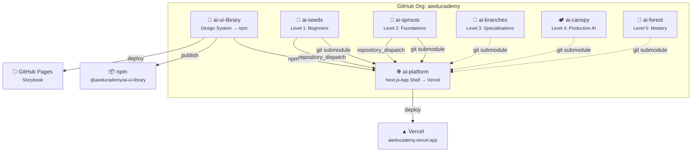

<div align="center">

# 🌐 AI Educademy

### Learn AI from Zero to Hero — Free & Open Source

<br />


<br />

A **free, open-source AI education platform** with 10 structured programs across 2 learning tracks, available in 5 languages. From absolute beginners to advanced practitioners — learn AI interactively with MDX lessons, a built-in playground, progress tracking, and certificates.

<br />

[**🚀 Start Learning**](https://aieducademy.vercel.app) &nbsp;·&nbsp; [**🎨 Storybook**](https://aieducademy.github.io/ai-ui-library/) &nbsp;·&nbsp; [**📦 UI Library**](https://www.npmjs.com/package/@aieducademy/ai-ui-library) &nbsp;·&nbsp; [**🤝 Contributing**](CONTRIBUTING.md)

<br />

</div>

---

## 📸 Screenshot

> [Screenshot coming soon]

---

## ✨ Features

| | Feature | Description |
|---|---------|-------------|
| 🌍 | **Multilingual** | English, French, Dutch, Hindi, Telugu — add your language! |
| 📚 | **10 Programs** | Structured curriculum across 2 tracks (AI Learning + Craft Engineering) |
| 🎮 | **Interactive Playground** | AI drawing recogniser — experiment hands-on in the browser |
| 📱 | **PWA Ready** | Install as an app on any device with offline support |
| 🏆 | **Progress Tracking** | Per-program dashboard with completion tracking |
| 🔐 | **Auth + Guest Mode** | GitHub OAuth sign-in or learn as a guest |
| 🌙 | **Dark / Light Mode** | System preference detection + manual toggle |
| 📝 | **MDX Lessons** | Rich content with syntax highlighting, illustrations, and interactivity |
| 🎨 | **Design System** | Shared UI library with [Storybook](https://aieducademy.github.io/ai-ui-library/) |
| ⚡ | **Auto-deploy** | Content changes in any course repo trigger instant platform rebuild |

---

## 🚀 Quick Start

```bash
# Clone with submodules (important!)
git clone --recurse-submodules https://github.com/aieducademy/ai-platform.git
cd ai-platform

# Install dependencies
npm install

# Set up environment variables
cp .env.example .env.local

# Start dev server
npm run dev
```

Open [http://localhost:3000](http://localhost:3000) 🎉

> **Note:** Content repos are git submodules. If you cloned without `--recurse-submodules`, run:
> ```bash
> git submodule update --init --recursive
> ```

---

## 🏛️ Platform Architecture



---

## 🌱 Learning Tracks

AI Educademy offers **2 learning tracks** with a nature growth metaphor — a seed grows into a forest:

### 🧠 Track 1: AI Learning

| Level | Program | Description | Status |
|-------|---------|-------------|--------|
| 1 | [🌱 AI Seeds](https://github.com/aieducademy/ai-seeds) | Absolute beginners — no code, no maths | ✅ Live |
| 2 | [🌿 AI Sprouts](https://github.com/aieducademy/ai-sprouts) | Foundations — data, algorithms, neural nets | ✅ Live |
| 3 | [🌳 AI Branches](https://github.com/aieducademy/ai-branches) | Specialisations — ML, CV, NLP, GenAI | ✅ Live |
| 4 | [🏕️ AI Canopy](https://github.com/aieducademy/ai-canopy) | Production AI — MLOps, RAG, governance | ✅ Live |
| 5 | [🌲 AI Forest](https://github.com/aieducademy/ai-forest) | Mastery — research, leadership, frontier AI | ✅ Live |

### 🛠️ Track 2: Craft Engineering

| Level | Program | Description | Status |
|-------|---------|-------------|--------|
| 1 | ✏️ AI Sketch | Getting started with AI tools | ✅ Live |
| 2 | 🪨 AI Chisel | Shaping your AI skills | ✅ Live |
| 3 | ⚒️ AI Craft | Building with AI | ✅ Live |
| 4 | 💎 AI Polish | Refining AI solutions | ✅ Live |
| 5 | 🏆 AI Masterpiece | Creating production-grade AI | ✅ Live |

---

## 🛠️ Tech Stack

| Technology | Version | Purpose |
|-----------|---------|---------|
| [Next.js](https://nextjs.org/) | 16 | App framework (App Router + Turbopack) |
| [TypeScript](https://www.typescriptlang.org/) | 5.9 | Type safety (strict mode) |
| [React](https://react.dev/) | 19 | UI library |
| [Tailwind CSS](https://tailwindcss.com/) | 4 | Utility-first styling |
| [next-intl](https://next-intl.dev/) | 4 | Internationalization (5 languages) |
| [NextAuth.js](https://next-auth.js.org/) | 5 | Authentication (GitHub OAuth) |
| [MDX](https://mdxjs.com/) | 3 | Rich lesson content |
| [Framer Motion](https://www.framer.com/motion/) | 12 | Animations & transitions |
| [Serwist](https://serwist.pages.dev/) | 9 | PWA / Service Worker |
| [Playwright](https://playwright.dev/) | 1.58 | End-to-end testing |
| [Vercel](https://vercel.com/) | — | Deployment & analytics |

---

## 📁 Project Structure

```
ai-platform/
├── src/
│   ├── app/[locale]/              # i18n-aware routes
│   │   ├── page.tsx               # Homepage with program picker
│   │   ├── programs/[programSlug]/lessons/[slug]/
│   │   ├── dashboard/             # Progress dashboard
│   │   ├── playground/            # AI playground
│   │   └── about/                 # About page
│   ├── components/
│   │   ├── auth/                  # SignIn, UserMenu
│   │   ├── lessons/               # LessonRenderer, LessonComplete
│   │   ├── playground/            # DrawingRecogniser
│   │   └── ui/                    # Navbar, Footer, LanguageSwitcher
│   ├── hooks/                     # useProgress, useGuestProfile
│   ├── i18n/                      # Locale config + routing
│   ├── lib/                       # Data layer (programs, lessons)
│   └── middleware.ts              # i18n routing middleware
├── content/
│   ├── programs.json              # Program registry (10 programs)
│   └── programs/
│       ├── ai-seeds/              # ← git submodule
│       ├── ai-sprouts/            # ← git submodule
│       └── ...                    # 10 program submodules
├── messages/                      # Translation files (en, fr, nl, hi, te)
├── e2e/                           # Playwright E2E tests
└── public/                        # Static assets
```

---

## 📖 Content Architecture

Each program lives in its own repo and is pulled in as a **git submodule**:

```
content/programs/ai-seeds/
├── lessons/
│   ├── en/                        # English lessons
│   │   ├── 01-what-is-ai.mdx
│   │   └── 02-ai-in-daily-life.mdx
│   ├── fr/                        # French lessons
│   ├── nl/                        # Dutch lessons
│   ├── hi/                        # Hindi lessons
│   └── te/                        # Telugu lessons
└── program.json                   # Program metadata
```

**MDX Frontmatter Schema:**

```yaml
---
title: "What is AI?"
description: "A friendly introduction to Artificial Intelligence"
order: 1
duration: "10 min"
difficulty: "beginner"
tags: ["ai", "introduction"]
---
```

---

## 🤝 Contributing

We'd love your help! See **[CONTRIBUTING.md](CONTRIBUTING.md)** for the full guide.

**Quick ways to contribute:**

| Contribution | Where |
|-------------|-------|
| 🌍 **Add a translation** | Fork a content repo → add `/lessons/{locale}/` folder |
| 📝 **Write a lesson** | Create an MDX file following the frontmatter schema |
| 🎨 **Improve UI** | Contribute to [ai-ui-library](https://github.com/aieducademy/ai-ui-library) |
| 🐛 **Fix bugs** | Check [open issues](https://github.com/aieducademy/ai-platform/issues) |
| 🌐 **Translate UI strings** | Edit files in `/messages/{locale}.json` |
| 📖 **Improve docs** | PRs to this README or lesson content |

---

## 🗺️ Roadmap

- [ ] 🏆 Certificate generation on program completion
- [ ] 🤖 AI tutor chatbot (RAG-based, per-lesson context)
- [ ] 📊 Analytics dashboard for educators
- [ ] 🔌 LMS integration (LTI support)
- [ ] 🌍 Community-driven translation portal
- [ ] 📱 Native mobile app (React Native)
- [ ] 🧪 Interactive code exercises with in-browser execution
- [ ] 🎯 Personalised learning paths

---

## 📦 Related Repos

| Repo | Description | Links |
|------|-------------|-------|
| [`ai-ui-library`](https://github.com/aieducademy/ai-ui-library) | 🎨 Shared design system | [npm](https://www.npmjs.com/package/@aieducademy/ai-ui-library) · [Storybook](https://aieducademy.github.io/ai-ui-library/) |
| [`ai-seeds`](https://github.com/aieducademy/ai-seeds) | 🌱 Level 1: Absolute beginners | [Live](https://aieducademy.vercel.app/programs/ai-seeds) |
| [`ai-sprouts`](https://github.com/aieducademy/ai-sprouts) | 🌿 Level 2: Foundations | [Live](https://aieducademy.vercel.app/programs/ai-sprouts) |
| [`ai-branches`](https://github.com/aieducademy/ai-branches) | 🌳 Level 3: Specialisations | [Live](https://aieducademy.vercel.app/programs/ai-branches) |
| [`ai-canopy`](https://github.com/aieducademy/ai-canopy) | 🏕️ Level 4: Production AI | [Live](https://aieducademy.vercel.app/programs/ai-canopy) |
| [`ai-forest`](https://github.com/aieducademy/ai-forest) | 🌲 Level 5: Mastery | [Live](https://aieducademy.vercel.app/programs/ai-forest) |

---

## 📄 License

MIT © [AI Educademy](https://github.com/aieducademy)

---

<div align="center">

**If you find this useful, please ⭐ star the repo!**

Made with ❤️ by the [AI Educademy](https://github.com/aieducademy) community

</div>

