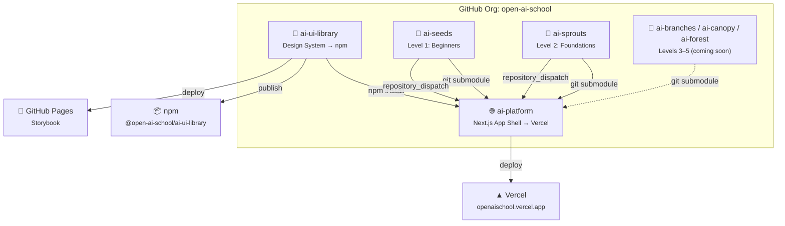

<div align="center">

# 🌐 Open AI School — Platform

**A free, multilingual AI education platform for everyone**

[](https://openaischool.vercel.app)
[](https://github.com/open-ai-school/ai-platform/actions/workflows/ci.yml)
[](LICENSE)
[](https://www.typescriptlang.org/)
[](https://nextjs.org/)
[](https://openaischool.vercel.app)

The main application shell that powers **Open AI School** — routing, authentication, internationalization, and program discovery. Built with Next.js 16, TypeScript strict mode, and the shared [`@open-ai-school/ai-ui-library`](https://www.npmjs.com/package/@open-ai-school/ai-ui-library) design system.

[**🚀 Start Learning**](https://openaischool.vercel.app) · [**🎨 Storybook**](https://open-ai-school.github.io/ai-ui-library/) · [**📦 npm**](https://www.npmjs.com/package/@open-ai-school/ai-ui-library)

</div>

---

## ✨ Features

- 🗂️ **Multi-program architecture** — extensible program system (`/programs/ai-seeds/lessons/...`)
- 🔐 **Authentication** — GitHub OAuth via NextAuth.js + guest mode
- 🌍 **5 languages** — English, French, Dutch, Hindi, Telugu via next-intl
- 📝 **MDX lessons** — Rich content with frontmatter, syntax highlighting, illustrations
- 🎨 **Shared design system** — All UI from [`@open-ai-school/ai-ui-library`](https://www.npmjs.com/package/@open-ai-school/ai-ui-library)
- 🌙 **Dark / light mode** — System preference detection + manual toggle
- 📊 **Progress tracking** — Per-program, localStorage-based with dashboard
- 🎮 **AI Playground** — Interactive drawing recogniser
- ⚡ **Auto-deploy** — Content changes in any course repo trigger platform rebuild

## 🏛️ Platform Architecture



## 🌱 Learning Path

Open AI School follows a **nature growth metaphor** — a seed grows into a forest:

| Level | Program | Description | Status |
|-------|---------|-------------|--------|
| 1 | [🌱 AI Seeds](https://github.com/open-ai-school/ai-seeds) | Absolute beginners — no code, no maths | ✅ Live |
| 2 | [🌿 AI Sprouts](https://github.com/open-ai-school/ai-sprouts) | Foundations — data, algorithms, neural nets | 🚧 Coming soon |
| 3 | 🌳 AI Branches | Applied AI — real-world projects | 📋 Planned |
| 4 | 🏕️ AI Canopy | Advanced topics — deep learning, NLP | 📋 Planned |
| 5 | 🌲 AI Forest | Expert / research — cutting edge AI | 📋 Planned |

## 📁 Project Structure

```
ai-platform/
├── src/
│   ├── app/[locale]/              # i18n-aware routes
│   │   ├── page.tsx               # Homepage with program picker
│   │   ├── programs/[programSlug]/lessons/[slug]/
│   │   ├── dashboard/             # Progress dashboard
│   │   ├── playground/            # AI playground
│   │   └── about/                 # About page
│   ├── components/
│   │   ├── auth/                  # SignIn, UserMenu
│   │   ├── lessons/               # LessonRenderer, LessonComplete
│   │   ├── playground/            # DrawingRecogniser
│   │   └── ui/                    # Navbar, Footer, LanguageSwitcher
│   ├── hooks/                     # useProgress, useGuestProfile
│   ├── i18n/                      # Locale config + routing
│   ├── lib/                       # Data layer (programs, lessons)
│   └── middleware.ts              # i18n routing middleware
├── content/
│   ├── programs.json              # Program registry
│   └── programs/
│       ├── ai-seeds/              # ← git submodule
│       └── ai-sprouts/            # ← git submodule
├── messages/                      # Translation files (en, fr, nl, hi, te)
└── public/                        # Static assets
```

## 🚀 Quick Start

```bash
# Clone with submodules (important!)
git clone --recurse-submodules https://github.com/open-ai-school/ai-platform.git
cd ai-platform

# Install dependencies
npm install

# Start dev server
npm run dev
```

Open [http://localhost:3000](http://localhost:3000).

> **Note:** Content repos are git submodules. If you cloned without `--recurse-submodules`, run:
> ```bash
> git submodule update --init --recursive
> ```

## 🛠️ Tech Stack

| Technology | Purpose |
|-----------|---------|
| [Next.js 16](https://nextjs.org/) | App framework (App Router) |
| [TypeScript](https://www.typescriptlang.org/) | Type safety (strict mode) |
| [Tailwind CSS 4](https://tailwindcss.com/) | Utility-first styling |
| [next-intl](https://next-intl.dev/) | Internationalization |
| [NextAuth.js](https://next-auth.js.org/) | Authentication (GitHub OAuth) |
| [MDX](https://mdxjs.com/) | Rich lesson content |
| [Framer Motion](https://www.framer.com/motion/) | Animations |
| [Vercel](https://vercel.com/) | Deployment |

## 🌐 Deployment

Deployed automatically to [Vercel](https://vercel.com) on every push to `main`. Content updates in course repos (ai-seeds, ai-sprouts, etc.) trigger a platform rebuild via `repository_dispatch`.

**Live:** [openaischool.vercel.app](https://openaischool.vercel.app)

## 🤝 Contributing

We welcome contributions! Whether it's:
- 🌍 **Translating** lessons to new languages
- 📝 **Writing** new course content
- 🎨 **Improving** UI components ([ai-ui-library](https://github.com/open-ai-school/ai-ui-library))
- 🐛 **Fixing** bugs or improving accessibility

See the repo-specific contributing guides for details.

## 📦 Related Repos

| Repo | Description | Links |
|------|-------------|-------|
| [`ai-ui-library`](https://github.com/open-ai-school/ai-ui-library) | 🎨 Shared design system | [npm](https://www.npmjs.com/package/@open-ai-school/ai-ui-library) · [Storybook](https://open-ai-school.github.io/ai-ui-library/) |
| [`ai-seeds`](https://github.com/open-ai-school/ai-seeds) | 🌱 Level 1: Absolute beginners | [Live](https://openaischool.vercel.app/programs/ai-seeds) |
| [`ai-sprouts`](https://github.com/open-ai-school/ai-sprouts) | 🌿 Level 2: Foundations | Coming soon |

## 📄 License

MIT © [Open AI School](https://github.com/open-ai-school)

